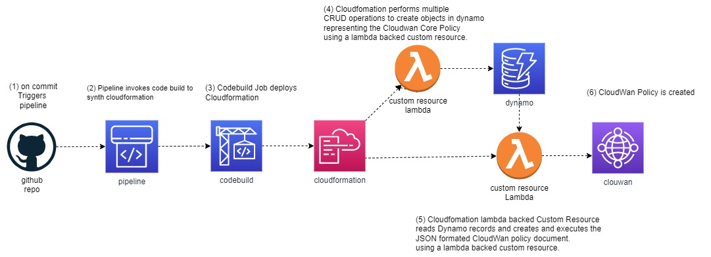

# Raindancers Network

The raindancers network library, provides a set of CDK constructs which provide classes and methods for building networks with global scale, with resources such as

- AWS Cloudwan
- AWS transitGateways
- AWS DXGateways
- AWS Site to Site Ipsec VPNs
- AWS VPC's
- AWS Network Firewalls

AWS Cloudwan provides capablitys and topologies that are similar to those found in technologys such as MPLS VPNs, which where difficult, if not impossible with transit gateways. 

## Motivation:

Raindancers network constructs were developed to met the specific requirements of a client who will be moving from a single region to a multi region environment, with a mix of both on premises and cloud based resources, that are both 'server' and 'serverless'  The client is implementing a 'everything is code' approach to its workflow.  

The construct has been developed primarly with the clients requirements in mind, and could be considered opinionated in some regards, however it likely has wider use. 

The project has developed over time to add additional capablitys, and is expected that over time, it will continue to evolve.

## Design Principals

#### Everything is code.
Everything* is code for this project. Everything about the project can be committed to a git repo.   This ensures that every detail of a project is captured.

#### Decompostion

Object-oriented decomposition, is used to break a large complex into progressively smaller classes or objects that are responsible for some part of the problem domain.  AWS cloudWan presents a monolithic core wan policy that does not lend itself well to OOP. 

## Technology Choices

Raindancers network construct is a polyglot AWS Cloud Development Kit (CDK) jsii construct, in a project created by projen

#### CDK
The AWS Cloud Development Kit is a set of tools and libraries enabling us to provision, configure and manage AWS services. Under the hood, it is using AWS CloudFormation — but instead of requiring us to write YAML to define our resources, it allows us to use general purpose programming languages such as JavaScript, TypeScript, Python, Java, C#, and Go

#### CDK Constructs
Constructs are the building blocks of AWS CDK apps. A construct represents a "cloud component" and encapsulates everything AWS CloudFormation needs to create the component.  

This construct is higher-level (L3) abstraction consisting of multiple resources, primarly related to Cloudwan and VPC.

#### jsii
Jsii allows you to write a library once in TypeScript, and then use the jsii tooling to generate the libraries for other languages. jsii does not cross-compile code. Instead, it analyzes the API surface exposed by the TypeScript classes and generates language-specific wrappers for them.  These then interact with the code you wrote in TypeScript (which has been transpiled to JavaScript for you) running in a Node process.  You can read more on the inner workings of jsii. (
 https://aws.amazon.com/blogs/opensource/how-the-jsii-open-source-framework-meets-developers-where-they-are/ )

#### [projen](https://github.com/projen/projen)
 
projen synthesizes project configuration files such as package.json, tsconfig.json, .gitignore, GitHub Workflows, eslint, jest, etc from a well-typed definition written in JavaScript.

As opposed to existing templating/scaffolding tools, projen is not a one-off generator.  To create and modify a project setup, users interact with rich strongly-typed class and execute projen to update their project configuration files.

#### constructs.dev

constructs.dev is an aws service, which provides a convienent and simple way for to share CDK constructs so they can be easily found and shared.  

## Design

### [`CoreNetwork`](https://constructs.dev/packages/raindancers-network/v/1.8.19/api/CoreNetwork?lang=typescript) construct

Cloudwan, only provides interfaces to upload, and execute  entire CoreNetwork policys.  This makes it difficult to modify the core network after its intial creation, programatically. 

To overcome the lack of interfaces, the construct models the core network as objects. The properties of the objects corrospond to the items in the [CoreWan policy json document]( https://docs.aws.amazon.com/network-manager/latest/cloudwan/cloudwan-policies-json.html)

The objects that are created are

* A core configuration, that defines the 'global' configuration items.

* Network Segments.  This defines network segments that will be created in the core nework.  Each nework segment has properties.

* Segment Actions. These define actions, such as sharing or routes

* Attachment Policys: these define how vpcs and other attachments are allow to connect to the Core Network.

The construct writes these items to a dynamodb table, by way of CRUD actions, which are implemeneted by lambda backed custom resources.     The corewan policy is updated by the the method updatePolicy() which is called when updates are completed.    A custom resource, scans the table and calls the apis to create and execute a new corenetwork policy.

Using dynamodb tables to hold configuration, was chosen over ssm parameters as the configuraton could easily exceed the maxium size of an ssm parameter. 

#### Methods for corewan.

The corewan construct has two methods [`share()`](https://constructs.dev/packages/raindancers-network/v/1.8.18/api/CoreNetwork?lang=typescript#share), and [`updatePolicy()`](https://constructs.dev/packages/raindancers-network/v/1.8.18/api/CoreNetwork?lang=typescript#updatePolicy) The share policy method provides a way to make the core wan avaialble to multiple accounts, or principals, ( such as an organisation)

### CloudWanTGW Construct

This construct is used to create a TransitGateway that is attached to a Cloudwan Core Segment.   It has a number of opinionated methods that work with the CoreNetworkConstruct, which includes;   

The use of transit Gateways is still important Cloudwan does not have full feature partity with TG yet. 

[`adds2sVPN()`](https://constructs.dev/packages/raindancers-network/v/1.8.19/api/CloudWanTGW?lang=typescript#adds2sVPN) This method creates a site to site Ipsec VPN, between the transit gateway and onprem

[`createDirectConnectGatewayAssociation`](https://constructs.dev/packages/raindancers-network/v/1.8.19/api/CloudWanTGW?lang=typescript#createDirectConnectGatewayAssociation), this associates a Transit Gateway with A Direct Connect Gateway.

### [`EnterpriseVPC`](https://constructs.dev/packages/raindancers-network/v/1.8.19/api/EnterpriseVpc?lang=typescript) Construct

Enteprise VPC's take the stock ec2.Vpc and provide numerous  methods primarly related to connecting to internal networks. This construct follows the the key pattern of [composition](https://en.wikipedia.org/wiki/Composition_over_inheritance) 
This is a high-level construct that is composed from several other lower-level constructs.

The Enterprise VPC takes a [`ec2.Vpc`](https://docs.aws.amazon.com/cdk/api/v2/docs/aws-cdk-lib.aws_ec2.Vpc.html) as its only property, and adds a collection of methods to it. 

The methods include

[`addCoreRoutes`](https://constructs.dev/packages/raindancers-network/v/1.8.19/api/EnterpriseVpc?lang=typescript#addCoreRoutes) This method creates routes in the CoreWan Network policy pointing to te vpcs core want attachment.  This is useful for situations such as inserting a default route for an egreess vpc

[`addR53Zone`]() This method adds an Internal Route53 Zone and associates it with the vpc. 

[`addRoutes`]() This method will create routes in a vpc in the various routing tables associated with subnets. (note the ec2.Vpc construct, creates a routing table per subnet). Routes can be targeted at the Cloudwan, a transit gateway, or a Network Firewall

[`attachToCloudWan`]() This method will attach a vpc to cloudwan segment.  (note: the construct does not current approved connections well, as they require a manual intervention)

[`attachToTransitGateway`]() Attachment the vpc to a transit gateway. 

[`createFlowLog`]() This method creates a vpc flow log, and optionally sets up athena querys to permit easy analysis of the flow log.

[`shareSubnetGroup`]() This method will share a subnet group to another account. This is useful, when the VPC is in one account ( such as a network account ) but another account needs to use it to place resoruces in 

