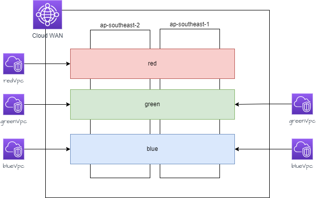

# Raindancers Network - Create Vpcs that are attached to a cloudwan vpc

In this example, we will create five new vpcs, two in the singapore region, and three in the sydney region. It builds on the [previous step]('./gettingstarted.md'), which needs to be completed first.  



There are multiple approaches that could be taken to implement Vpc's, and in fact a project and this example, should only be regarded as an example, not a definative set of rules.

* 1.1 Create a new file `lib\sydneyVpc.ts`.  ( The complete file is here can be found here  [Github Gist - sydneyVpc.ts](https://gist.github.com/mrpackethead/38280b71234ab31cc4b887d71c58e314) )

import the required modules

```typescript
import * as cdk from 'aws-cdk-lib';
import { Construct } from 'constructs';
import { 
	aws_networkmanager as networkmanager,
	aws_ec2 as ec2

}
from 'aws-cdk-lib';
import * as raindancersNetwork from 'raindancers-network';
```

* 1.2  Create a interface which will be used in the stack we are creating for the Sydney VPC's
```typescript
interface SydneyVpcProps extends cdk.StackProps {
	corenetwork: raindancersNetwork.CoreNetwork
	blueSegment: raindancersNetwork.CoreNetworkSegment
	redSegment: raindancersNetwork.CoreNetworkSegment
	greenSegment: raindancersNetwork.CoreNetworkSegment
}
```
In our project we need the corenetwork, and the blue, red and green segments.  these will be passed as propertys when the class is called.

* 1.3 Create a new class, for the stack that will contain the Sydney Vpc's, and add vpc's which will be attached to the red, green and blue nework segments.  

```typescript
export class SydneyVpc extends cdk.Stack {
  constructor(scope: Construct, id: string, props?: SydneyVpcProps) {
    super(scope, id, props);
```

Using the EnterpriseVpc, ( which is a high order, composistion construct ) we are able to create VPC's, Subnets, and Routing Tables easily.  The EnterpriseVpc, itself takes a cdk ec2.Vpc class as a property, so all functionality that applies to that can also be used.  Shown is the redVpc, the blue and green follow the same pattern, add them as well.   Note that we configure a subnetgroup called 'linknet'.  This subnet is used by default for the interconnections between the corenetwork and the vpc

```typescript
const redVpc = new raindancersNetwork.EnterpriseVpc(this, 'redEvpc', {
	vpc: new ec2.Vpc(this, 'redvpc', {
		ipAddresses: ec2.IpAddresses.cidr('10.10.0.0/23'),
		maxAzs: 2,
		natGateways: 0,
		subnetConfiguration: [
			{
				name: 'linknet',
				cidrMask: 27,
				subnetType: ec2.subnetType.PRIVATE_ISOLATED,
			}
			{
				name: 'redsubnet',
				cidrMask: 24,
				subnetType: ec2.SubnetType.PRIVATE_ISOLATED,
			}
		],
	})
})
```

* 1.4 Attach the VPC to the Clouwan

The attachToCloudWan() method, attaches the a vpc to the cloudwan.  Repeat this for the other vpcs as well.


```typescript
redVpc.attachToCloudWan({
	coreNetworkName: props?.corenetwork.coreName as string,
	segmentName: props?.redSegment.segmentName as string
})
```

* 1.5 Add Default route to the cloudwan

In this example network, we want all our vpcs to route any non local traffic towards the clouwan.   Use the `addRoutes` method on the vpc.  When the vpc is created, every subnet has a route table associated with it. This allows us to specify at a subnet level how routes are set up.  

```typescript
redVpc.addRoutes({
		cidr: ['0.0.0.0/0'],
		description: 'defaultroute',
		subnetGroups: [
		  'linknet',
		  'redsubnet'
		],
		destination: raindancersNetwork.Destination.CLOUDWAN,
		cloudwanName: props?.corenetwork.coreName as string,
	});
```	

* 2.1  Create a new file `lib\singaporeVpc.ts`.  This will hold the Vpc's fgit por Singapore. The format of this file follows the same format as that of Sydney. 

 ( The complete file is here can be found here  [Github Gist - singaporeVpc.ts](https://gist.github.com/mrpackethead/97106f8860e66199c303b6e1e69aaa99) )

 Note that in the singapore Vpc stack we do not create a red VPC


 * 3.1  Edit 'lib\raindancers-network-stack'. 

 We will pass the corenetnet and network segments that were created, as propertys of the class, to the stacks that create the vpcs.

 add the following attributes to the class, ( this shoudl be inserted between the class, and the constructor)

 ```typescript
  corenetwork: raindancersNetwork.CoreNetwork
  redSegment: raindancersNetwork.CoreNetworkSegment
  greenSegment: raindancersNetwork.CoreNetworkSegment
  blueSegment: raindancersNetwork.CoreNetworkSegment
```

Now edit the various segments, 

`redSegment` becomes `this.redSegment` 
`greenSegment` becomes `this.greenSegmet`
`blueSegment` becomes `this.blueSegment`

and edit the corenetwork

`corenetwork` becomes `this.corenetwork`


* 3.2 open and edit `bin\raindancers-network.ts` 

We need to instatinate calls for the Sydney and Singapore Vpc Stacks. First import the Singapore and Syndey Stacks

```typescript
import { SydneyVpc } from '../lib/sydneyVpc';
import { SingaporeVpc } from '../lib/singaporeVpc';
```

Then instanate the class, passing the propertys as required to the stacks

```typescript
new SydneyVpc(app, 'SydneyVPC', {
  env: { account: '123456789012', region: 'ap-southeast-2' },
  corenetwork: core.corenetwork,
  redSegment: core.redSegment,
  greenSegment: core.greenSegment,
  blueSegment: core.blueSegment
})

new SingaporeVpc(app, 'SydneyVPC', {
  env: { account: '123456789012', region: 'ap-southeast-1' },
  corenetwork: core.corenetwork,
  greenSegment: core.greenSegment,
  blueSegment: core.blueSegment
})
```

You can now synth `cdk synth` and deploy `cdk deploy` the stacks.   After deployment, check the Clouwan Networks in the console. You will see that routes have propogated, and that the sydney and singapore Vpc's will be able to to communicate.

[➔ Next: Optional, create a Common Managed Egress Firewall using AWS networkfirewall](egress.md)


  


