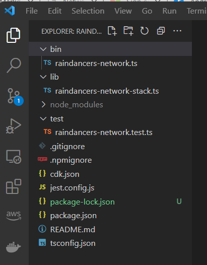

# Raindancers Network - Getting Started with the example projet


## Prequisites
To use this project, you'll need the following prerequisties

1. [AWS Account and User](https://docs.aws.amazon.com/cli/latest/userguide/getting-started-prereqs.html)

1. AWS CLI. The AWS CLI allows you to interact with AWS services from a terminal session. Make sure you have the latest version of the AWS CLI installed on your system. If you need to install this, follow the [User Guide for Version 2](https://docs.aws.amazon.com/cli/latest/userguide/getting-started-install.html)


3. Node.js  A version in active long-term support (18.x at this writing) is recommended.

If you want to use this construct with python, follow the [Python](python.md) instructions.


## To use the construct in Typescript.

This will guide you through a getting started experience in TypeScript. 

*A disclaimer about cost: Some of the steps in this guide will create resources that will bill your account*  

[TL;DR] If you are familar with AWS CDK, you can just skip reading the rest of this section, and jump to [Build an AWS Global Network with CDK](#build-a-global-network-with-cdk)
1. Create and change to a empty directory on your system:  
`mkdir raindancers-network && cd raindancers-network`

1. Initalise a new typescript project 
We will use cdk init to create a new TypeScript CDK project:  
`cdk init  --language typescript`


#### Project Structure  
Now’s a good time to open the project in your favorite IDE and explore.  If you are using VSCode, you'll should see something like this.



- `lib/raindancers-network-stack.ts` is where this application's main stack is defined, and where we will be doing most of the work.  
- `bin/raindancers-networks-stack.ts` is the entrypoint of the CDK application. It will load the stack defined in `lib/raindancers-network-stack.ts`
- `package.json` is the npm module manifest. It includes information like the name of your app, version, dependencies and build scripts like “watch” and “build” (package-lock.json is maintained by npm)
- `cdk.json` tells the toolkit how to run your app. In our case it will be "npx ts-node bin/raindancers-network.ts"
- `tsconfig.json` is your project’s typescript configuration
- `.gitignore` and `.npmignore` tell git and npm which files to include/exclude from source control and when publishing this module to the package manager.
- `node_modules` is maintained by npm and includes all your project’s dependencies

#### Application Entry Point

`bin/raindancers-network.ts` loads and instantiates the `RaindancersNetworkStack` class from `rainindancers-network-stack.ts` 

```typescript
#!/usr/bin/env node
import 'source-map-support/register';
import * as cdk from 'aws-cdk-lib';
import { RaindancersNetworkStack } from '../lib/raindancers-network-stack';

const app = new cdk.App();
new RaindancersNetworkStack(app, 'RaindancersNetworkStack', {
  // env: { account: '123456789012', region: 'us-east-1' },
});
```

#### Application Stacks

Open up lib/cdk-workshop-stack.ts. This is where the meat of our application will be

```typescript
import * as cdk from 'aws-cdk-lib';
import { Construct } from 'constructs';
// import * as sqs from 'aws-cdk-lib/aws-sqs';

export class RaindancersNetworkStack extends cdk.Stack {
  constructor(scope: Construct, id: string, props?: cdk.StackProps) {
    super(scope, id, props);

    // The code that defines your stack goes here

    // example resource
    // const queue = new sqs.Queue(this, 'RaindancersNetworkQueue', {
    //   visibilityTimeout: cdk.Duration.seconds(300)
    // });
  }
}
```
This is an empty project shell that we will build out

#### Synthesizing a template from your app

CDK apps are effectively a definition of your infrastructure using a general purpose coding plaform, such as typescript. When CDK apps are executed, they  *synthesize* an AWS CloudFormation template for each stack defined in your application.

To synthesize a CDK app, use the `cdk synth` command. note: The CDK CLI requires you to be in the same directory as your cdk.json file. 

synthesize a project by running the synth command. it should output a mostly empty Cloudformation template, it will also be saved in the `cdk.out` folder

```
cdk synth
```

#### Bootstrapping an environment, ready for CDK

So now we have got the a CloudFormation template ( albeit an empty one ), and it needs to be deployed into your account.  Before that can happen, *bootstrapping* of the environment needs to be peformed.  ( an environment is the combination of an account and region ). Bootstrapping only needs to be done once for each environment and many cdk apps can be deployed. 

The first time you deploy an AWS CDK app into an environment (account/region), you can install a “bootstrap stack”. This stack includes resources that are used in the toolkit’s operation. For example, the stack includes an S3 bucket that is used to store templates and assets during the deployment process.

You can use the cdk bootstrap command to install the bootstrap stack into an environment. run this command in your environment.

```
cdk bootstrap
```
If you are returned an Access Denied message at this step, verify that you have configured the AWS CLI correctly (or, specified an appropriate secret/access key), and also verify that you have permission to call cloudformation:CreateChangeSet within the scope of your account/session. If you have configured profiles, you may use the --profile flag in teh command.   

For more details refer to the [CDK Documentation - Bootstrapping ](https://docs.aws.amazon.com/cdk/v2/guide/bootstrapping.html)


## Build A Global Network With CDK

In this section, we will write some code that will deploy a global network with cdk.

While The raindancers constructs will allow the construction of various topologys, this example, will build out a simple example.  ( Other examples to be published )

### examplenet

Our project will build examplenet.  example net will;

- span two regions,  (ap-southeast-2/sydney and ap-southeast-1/singapore)
  - ap-southeast-1 ( Syndey)
  - ap-southeast-2 ( Singapore )
- have three network segments
  - red
  - green
  - blue
- Use the private Asn Range, 65200 - 65210
- Use the Cidr Block, 10.100.0.0/22 for inside Blocks


#### Create a core network

1. Install the raindancer-network construct in our project.    Execute the following `npm install raindancers-network`

1. Open the file `lib\raindancers-network-stack.ts`.  

Note: For reference you can look at the full completed project file, here.  Its recommended to build it yourself, so, you can get familar with the construct. 

* 2.1 At the top of the file, import these packages

```typescript
import {
  aws_networkmanager as networkmanager,
}
  from 'aws-cdk-lib';

import * as raindancersNetwork from 'raindancers-network';
```

* 2.2 Add the following code under the super section.  You can edit the values as you need, for example pick regions that match what you need. 

```typescript
const exampleNet = new raindancersNetwork.CoreNetwork(this, 'CoreNetwork', {
      globalNetwork: new networkmanager.CfnGlobalNetwork(this, 'GlobalNetwork', {
        description: 'exampleNet',
      }),
      policyDescription: 'example net',
      coreName: 'exampleNet',

      asnRanges: [
        '65200-65210',
      ],
      insideCidrBlocks: ['10.100.0.0/22'],

      edgeLocations: [
        {
          // sydney
          'location': 'ap-southeast-1',
          'asn': 65200,
          'inside-cidr-blocks': ['10.100.0.0/24'],
        },
        {
          // singapore
          'location': 'ap-southeast-2',
          'asn': 65201,
          'inside-cidr-blocks': ['10.100.1.0/24'],
        }
      ],
    });
```

This configuration details, follow what is required by Cloudwan to configure the CoreNetwork

* 2.3  Add Network Segments to the core Network

```typescript
    // the segments
    const redSegment = exampleNet.addSegment({
      name: 'red',
      description: 'red Segment',
      isolateAttachments: false,
      requireAttachmentAcceptance: false,
    });

    const blueSegment = exampleNet.addSegment({
      name: 'blue',
      description: 'blue Segment',
      isolateAttachments: false,
      requireAttachmentAcceptance: false,
    })

    const greenSegment = exampleNet.addSegment({
      name: 'green',
      description: 'green Segment',
      isolateAttachments: false,
      requireAttachmentAcceptance: false,
    })
```
  The addSegment method has several other configuration options, which may be used to build other configurations.  This configuraiton will make the segments avaialble in all regions that the corenework is configured.

* 2.4 Add Attachment policys to the segments
```typescript

redSegment.addAttachmentByTagPolicy({
  ruleNumber: 100,
});

greenSegment.addAttachmentByTagPolicy({
  ruleNumber: 200,
})

blueSegment.addAttachmentByTagPolicy({
  ruleNumber: 300,
})

```
This will build a very simple attachment policy that will allow vpc's to use an attachment Tag  `{'Key':'AttachmentValue', 'Value':<segmentName>}`


* 2.5  Add Network Segments to the core Network